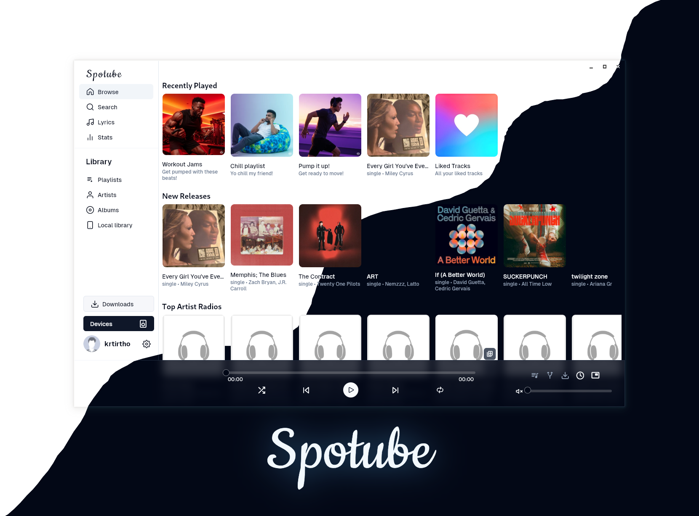
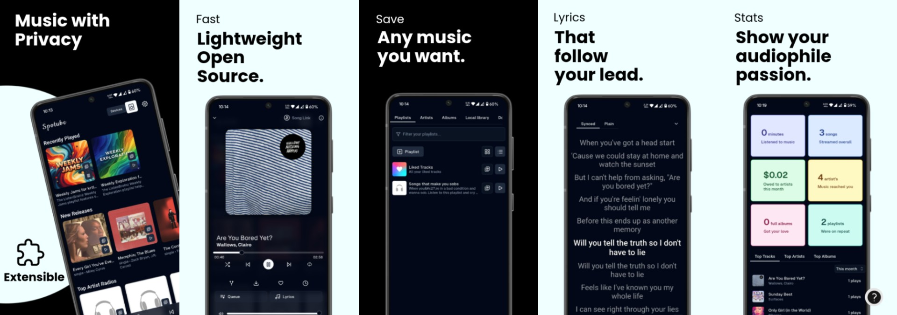

  

Una plataforma de streaming de música extensible, multiplataforma y de código abierto. 
Usa tus propios metadatos/listas de reproducción/fuentes de audio mediante plugins creados por la comunidad o por ti mismo. ¡Un pequeño paso hacia la era del streaming musical descentralizado!

No es solo otra app hecha con Electron 😉

---

## 🌃 Características

- 🧩 Basado en plugins: soporta cualquier plataforma o servicio musical personalizado.
- 🗺️ Plugins creados por la comunidad o por ti mismo.
- ⬇️ Descarga libre de canciones con metadatos.
- 🖥️📱 Compatible con múltiples plataformas.
- 🪶 Ligero y con bajo consumo de datos.
- 🕒 Letras sincronizadas en tiempo real.
- ✋ Sin telemetría ni recopilación de datos.
- 🚀 Alto rendimiento nativo.
- 📖 Software libre y de código abierto.
- 🔉 Control de reproducción local (no depende del servidor).

---

## 📜 ⬇️ Guía de instalación

Las nuevas versiones se publican cada 3-4 meses.

| Plataforma | Método |
|----------|--------|
| Windows | Descargar instalador `.exe` |
| MacOS | Descargar `.dmg` |
| Android | APK o F-Droid |
| iOS | Archivo `.ipa` (requiere AltStore) |
| Linux | Flatpak, Deb, RPM, Tarball |
| Arch | `yay` o `pamac` |
| Homebrew | `brew install --cask spotube` |
| Chocolatey | `choco install spotube` |
| Scoop | `scoop install spotube` |
| WinGet | `winget install KRTirtho.Spotube` |

---

### 🔄 Versiones Nightly

Puedes descargar versiones experimentales desde:
https://github.com/isairey/PlataformaStreamingMusic/releases/tag/nightly

---

## 🕳️ Compilar desde el código fuente

Puedes compilar el proyecto siguiendo las instrucciones en:

- CONTRIBUTION.md

---

## 👤 Autor

**Isai Reyes**
---

## 💼 Licencia

Este proyecto es de código abierto bajo la licencia **BSD-4-Clause**.

---

## 🙏 Créditos (resumen)

Este proyecto utiliza múltiples tecnologías y servicios, entre ellos:

- Flutter
- MPV
- MusicBrainz
- ListenBrainz
- yt-dlp
- Invidious
- SponsorBlock
- F-Droid
- Last.fm

Y muchas otras dependencias open-source.

